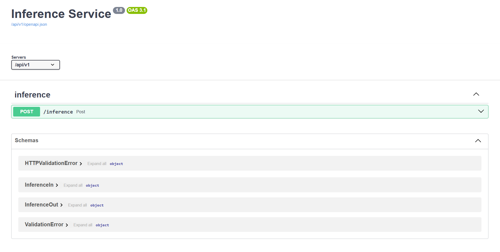
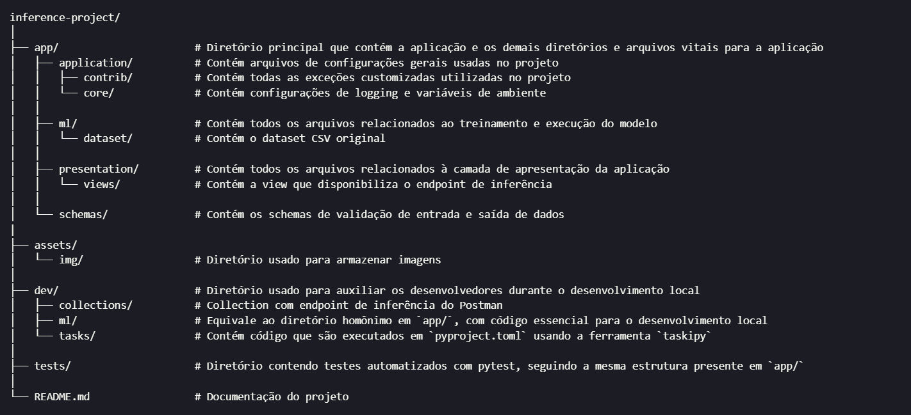

# <p align="center"> 🏨 Hotel Price Predictor

## Project Description
This API enables the classification of hotel reservations into price ranges based on key features from the provided dataset. Using a machine learning model trained on the Hotel Reservations Dataset from Kaggle, the system predicts which price range a reservation belongs to:

- 1 for prices ≤ 85,
- 2 for prices between 85 and 115,
- 3 for prices ≥ 115.

The original and transformed datasets are stored in AWS RDS, and the trained ML model is hosted in AWS S3. This API is designed to deliver accurate and efficient predictions, making it a scalable solution for price range classification in hotel bookings.

## Swagger


Access http://174.129.226.5/docs#/inference/post_inference_post in your preferred browser to post data directly via Swagger.

Alternatively, make a POST request to the endpoint http://174.129.226.5/api/v1/inference using `Postman` or any other API consumer of your choice. Check the available collections in `dev/collections/`.

## Technologies
<div align="center" style="display: inline_block;">
 </img>
 </img>
 
 </img>
 </img>
 </img>
 </img>
 </img>
 </img>
 </img>
 </img>
 </img>
 </img>

</div>

## Execution
First, clone the repository using:
``` shell
git clone https://github.com/Compass-pb-aws-2024-JUNHO/sprints-4-5-pb-aws-junho.git

```
Or (if you have SSH configured):
``` shell
git clone git@github.com:Compass-pb-aws-2024-JUNHO/sprints-4-5-pb-aws-junho.git

```

Switch to the `grupo-3` branch using: `git switch grupo-3`

### Development Environment
To properly install and manage dependencies, you need to configure a virtual environment using venv:

    Windows:
        Creation: python -m venv inference
        Activation: .\inference\Scripts\activate.bat

    Linux:
        Install python venv: sudo apt install python3-venv
        Creation: python -m venv inference
        Activation: source inference/bin/activate


Run the following command to install dependencies:
``` shell
pip install -r requirements.txt
```

Create a `.env` file and insert the credentials from `local.env`, replacing the values of variables prefixed with `AWS_` with your own credentials.

The S3 bucket was kept public during application development. If you want access to the model stored in the bucket, send a request to inferenceprojectmodelaccess@gmail.com using the following format:
- Subject: Access to S3 Bucket
- Body: Full Name - Corporate Compass Email

For local development, you should use the development `ModelHandler` defined in `dev/ml/main.py`. Replace the import in the file `app/presentation/views/inference.py` from `app` to `dev` as follows:

    app - from app.ml.main import ModelHandler
    dev - from dev.ml.main import ModelHandler


### Without Container
To run the API, execute:
``` shell
task run
```


### With Container (Docker)
If you don’t have [Docker](https://www.docker.com/) installed, follow the official documentation.

To build the application image, execute:
``` shell
docker build -t inference/inference-service:v1 .
```
To run the container:
``` shell
docker run -d --name inference -p 3000:3000 inference/inference-service
```

Then access http://localhost:3000/docs to use Swagger.

Alternatively, use http://localhost:3000/api/v1/inference in `Postman` or any other API consumer of your choice. Check the available collections in `dev/collections/`.

## Directory Structure


## Running Tests
To run tests, execute:

```bash
task test
```

To run a specific test, execute:

```bash
task test-matching "test-name"
```

## Development
To organize development and ensure smooth project progress, a Trello board was created with the necessary steps to follow.

If a problem arose that could compromise the progress of tasks assigned to each team member, the procedure was to allocate more members to help solve the problem more efficiently.

## Developers
| [<br><sub>Gustavo Felipe da Costa Silva</sub>](https://github.com/gusttavofelipe) |  [<br><sub>Hugo Bessa Susini Ribeiro</sub>](https://github.com/hsusini) |  [<br><sub>Jean Carlos Penha da Conceição</sub>](https://github.com/JeanPTBR) |  [<br><sub>Silvio Cabral de Melo Junior</sub>](https://github.com/SilvioCMJ)
| :---: | :---: | :---: | :---: | 

